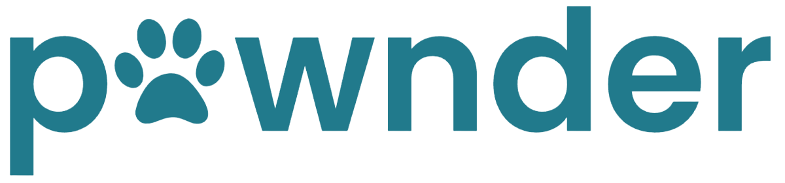
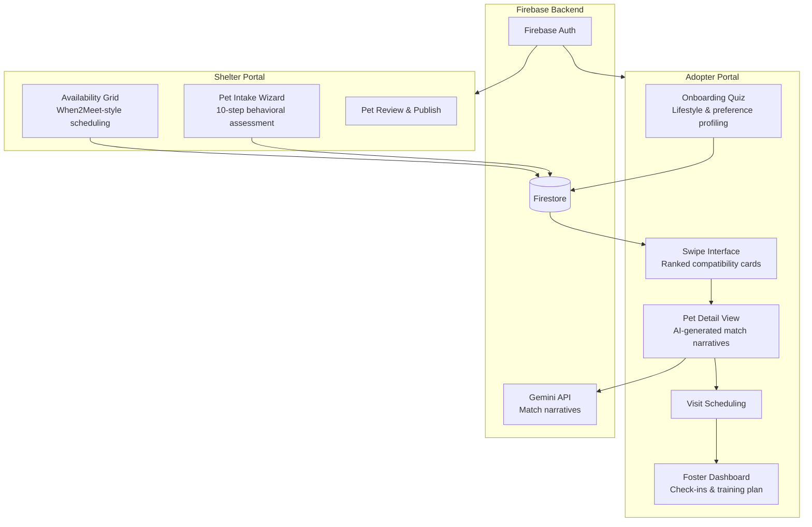

<p align="center">
  
</p>

<h3 align="center">Matching hearts, not just homes.</h3>

<p align="center">
  <strong>Cornell 2026 Animal Science Hackathon</strong>
</p>

<p align="center">
  <a href="https://youtu.be/MNTTCqhk4xE">
    
  </a>
</p>

<h4 align="center">
  <a href="https://youtu.be/MNTTCqhk4xE">Check out the demo on YouTube!</a>
</h4>

---

## The Problem

We don't have an adoption crisis. We have a **compatibility crisis**.

Every year, millions of pets enter shelters. Many get adopted. But according to the [National Library of Medicine](https://pubmed.ncbi.nlm.nih.gov/), **7-20% are returned** -- not because they're bad animals, but because they were mismatched. The current adoption system treats animals like listings, not individuals.

> **Sam** was adopted for nearly a year, then returned. He walked into the shelter wagging his tail, thinking he was visiting. He didn't know he wasn't going home again. *(Newsweek, 2025)*

> **Toothless** survived severe abuse -- maggot wounds, a broken arm, burn marks across his body. He was rescued, rehabilitated, adopted... and **returned within one hour** because of "foul mouth smell." He wasn't treated as an individual. He was treated as a product that didn't meet expectations. *(Newsweek, 2025)*

The current system matches on **surface traits** -- breed, size, age, basic temperament tags like "friendly" or "energetic." But long-term bonding doesn't depend on surface traits.

It depends on **behavioral alignment**.

---

## Our Solution

Pawnder is a **compatibility-first adoption platform** that matches pets and humans based on *who they are*, not just *what they are*.

We assess four dimensions of behavioral alignment:

| Dimension | What It Measures |
|---|---|
| **Energy Rhythms** | Does the animal need high stimulation, or quiet consistency? |
| **Stress Thresholds** | How quickly does the animal become overwhelmed, and how fast do they recover? |
| **Attachment Patterns** | Do they form secure bonds quickly, or need slow, predictable trust-building? |
| **Lifestyle Compatibility** | Does the adopter's schedule, environment, and experience actually support the animal's needs? |

When these factors align, bonding strengthens. When they don't, chronic stress increases -- even if the adoption looks successful on paper. Compatibility is a two-sided equation.

Pawnder creates bonds grounded in **mutualistic needs** -- not idealized preferences.

---

## How It Works

```
   Create Profile  -->  AI Matches  -->  First Date  -->  Foster Trial  -->  Forever Home
       (1)               (2)             (3)               (4)                (5)
```

1. **Create a Profile** -- Both the pet and adopter complete detailed behavioral and lifestyle assessments, building a foundation of real data.
2. **AI Compatibility Matching** -- Our algorithm analyzes both profiles and displays ranked compatibility matches within a defined geographic radius.
3. **It's a Date** -- A structured 60-minute in-person visit designed to observe real interaction and behavioral cues.
4. **Second Date** -- A 3-month foster-to-adopt period for real bonding, adjustment, and compatibility validation.
5. **Forever Home** -- Not based on impulse, but based on proven compatibility.

---

## System Architecture

Pawnder operates as a **dual-portal mobile application** -- one for shelters, one for adopters -- connected through a shared Firebase backend.



### Adopter Flow

Profile creation --> Behavioral onboarding --> Swipe through ranked matches --> View compatibility breakdown --> Confirm match --> Schedule visit from shelter availability --> Post-visit checkpoint --> 3-month foster with training plan & check-ins --> Adoption

### Shelter Flow

10-step pet intake (identity, health, social temperament, behavioral traits, daily needs, environment, training, observations, availability, media) --> Review & publish --> Pets appear in adopter feeds ranked by compatibility

---

## Tech Stack

| Layer | Technology |
|---|---|
| **Framework** | React Native 0.81 + Expo SDK 54 |
| **Language** | TypeScript 5.9 |
| **Navigation** | Expo Router (file-based routing) |
| **State Management** | Zustand |
| **Backend** | Firebase (Auth, Firestore, Cloud Functions) |
| **AI** | Google Gemini 2.0 Flash (personalized match narratives) |

---

## Business Model

Pawnder monetizes through **partnership boxes** delivered during the 3-month foster-to-adopt period.

Each adopter receives a curated box ($70-$120) containing products from partner brands, with revenue split 50/50:

- Food brands
- Preventive health products
- Pet insurance companies
- Toys and accessories
- Local services

### Revenue Projections (4M new adopters/year in the US)

| Market Share | Box Revenue | Sponsorship Placement | Customer Acquisition Cost |
|---|---|---|---|
| 1% | $1.4M - $2.4M | $150K / year | $5.36 |
| 3% | $4.2M - $7.2M | $250K / year | $3.57 |
| 5% | $7.0M - $12.0M | $450K / year | $3.21 |

**Value to partners:** Access to new customers, early loyalty capture, lower acquisition cost, and positive brand association through the adoption journey.

---

## Team

Built at the **Cornell 2026 Animal Science Hackathon** by four close friends who believe animals deserve better.

| Name | Role | Major |
|---|---|---|
| [**Bojro Das**](https://www.linkedin.com/in/bojro/) | Lead Engineer, Research | Computer Science + Math |
| [**Audrey Chen**](https://www.linkedin.com/in/audrey-chen-3782ba28a/) | Engineer | Computer Science |
| [**Kevin Yan**](https://www.linkedin.com/in/kevinyan18/) | Business & Strategy, Research | Applied Economics & Management |
| [**Jaelyn Chow**](https://www.linkedin.com/in/jaelyn-chow/) | Animal Behavior, Research | Animal Science |

---

## Scalability

| Vector | Strategy |
|---|---|
| **Geographic Expansion** | Radius-based matching naturally scales to new cities as shelters onboard |
| **Shelter Onboarding** | Low-friction 10-step intake wizard with no technical barrier -- shelter staff fill out a behavioral questionnaire per pet |
| **Data Flywheel** | Every match outcome (success, return, foster extension) feeds back into the compatibility model, improving accuracy over time |
| **Platform Stickiness** | The 3-month foster period with built-in training plans, check-ins, and partnership boxes creates sustained engagement beyond the initial match |
| **Sponsor Revenue** | CAC decreases as adoption volume grows -- high-value, intent-driven customers are attractive to pet industry brands |

---

<p align="center">
  <em>"He didn't know this was going to be goodbye."</em><br/>
  We're building a world where it doesn't have to be.
</p>
